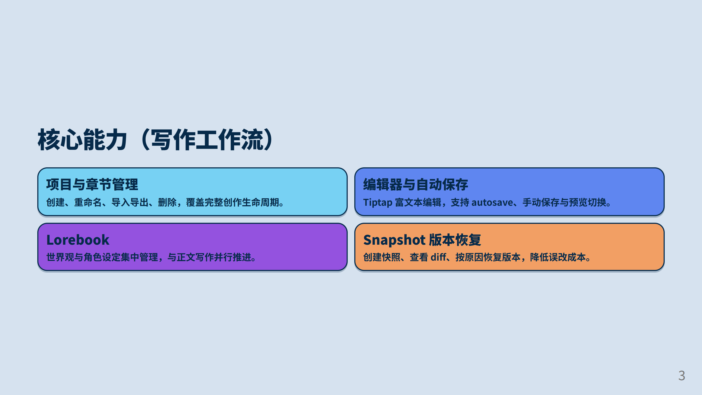
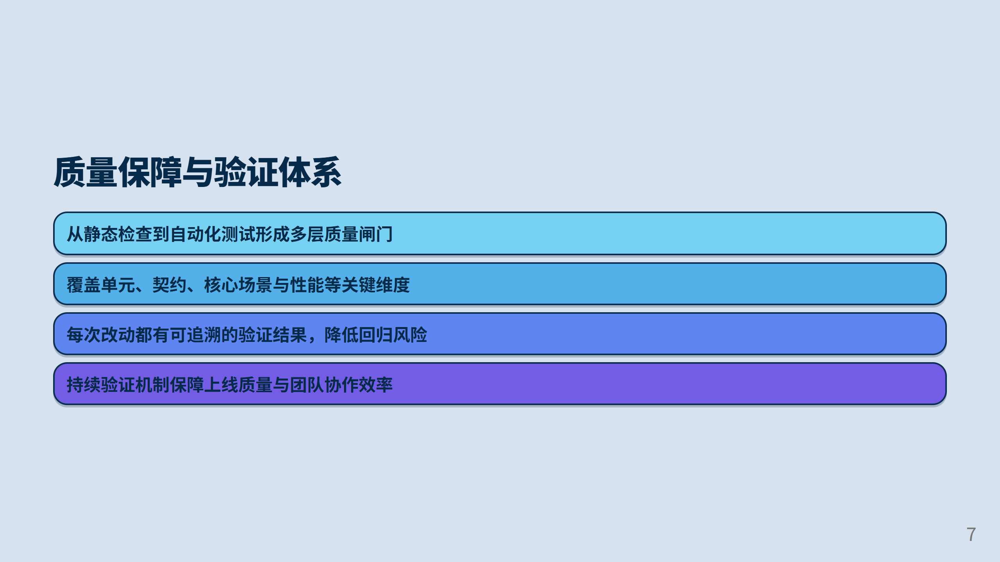

# CatNovel

> 目前还在紧张开发中，未打通使用流程

CatNovel 是一个面向长篇创作的本地优先 AI 小说工作台，聚焦「写作 + 知识检索 + AI 协作 + 版本恢复」的一体化工作流。

## 项目简介

- 三栏工作区：素材管理、正文创作、AI 协作可并行推进。
- 写作能力：章节管理、富文本编辑、自动保存、快照恢复。
- 知识能力：Lorebook、RAG 检索、Timeline 事件提取与聚合。
- 安全机制：高风险 AI 操作先审批再执行，减少误操作风险。

## 幻灯片预览图

以下图片由 `docs/slides/catnovel-intro.marp.md` 导出：





## 开发与编译

```bash
# 1) 安装依赖
pnpm install

# 2) 本地开发
pnpm dev

# 3) 编译生产版本
pnpm build

# 4) 生产模式运行
pnpm start
```

## 常用质量检查（可选）

```bash
pnpm run verify:static:60s
pnpm run verify:unit:60s
pnpm run verify:contract:60s
pnpm run verify:smoke:60s
```
